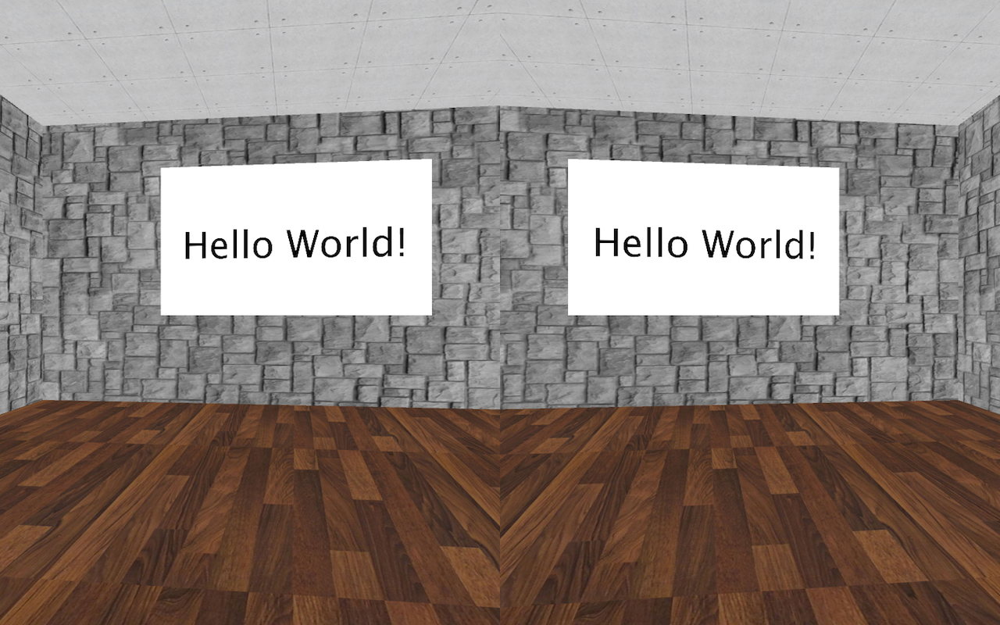
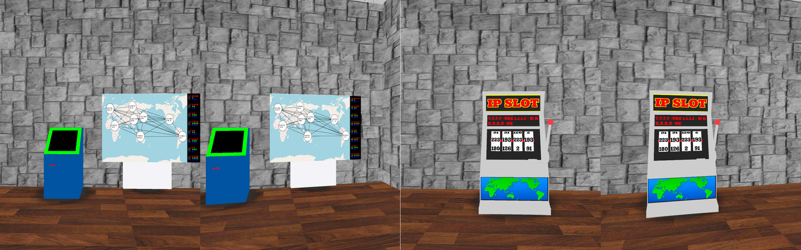
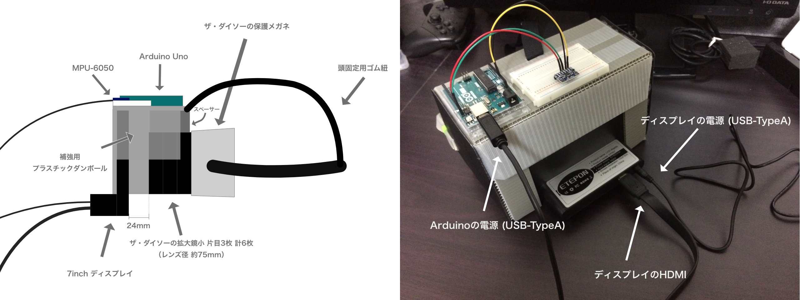

# Processing VR

大学の授業の最終発表にて、ProcessingでVRっぽいものを実装してみました。

これは私を合わせた4人で作成したプログラムです。以下のファイルは私の作成したものではありませんが、1つのプログラムとして公開するに当たって許可をもらって公開しています。

- processing_VR/gazoukakou.pde
- processing_VR/Machination.pde
- processing_VR/IP_Locate.pde

なお、processing_VRフォルダ内のzipファイルは解凍することで動作するようになっています。フォルダの階層は`processing_VR/models/`以下にそれぞれのモデルデータのフォルダが来るようになっていれば問題ありません。

このプロジェクトではこちらの[動画](https://www.nicovideo.jp/watch/sm23739052)を参考にして以下のHMDも自作しました。

また、このプログラムは以下のライブラリを使用しています。

- [I2Cdev](https://github.com/jrowberg/i2cdevlib/tree/master/Arduino/I2Cdev) - Arduino
- [MPU6050](https://github.com/jrowberg/i2cdevlib/tree/master/Arduino/MPU6050) - Arduino
- [Game Control Plus](http://lagers.org.uk/gamecontrol/index.html) - Processing

## 使用した素材

- [Vending Kisosk
](https://sketchfab.com/3d-models/vending-kisosk-57b70f218103455dbb3a5f209ee27dd3?utm_source=triggered-emails&utm_medium=email&utm_campaign=model-downloaded) / [yogee1707](https://sketchfab.com/yogee1707)

## LICENSE

[MIT](LICENSE)